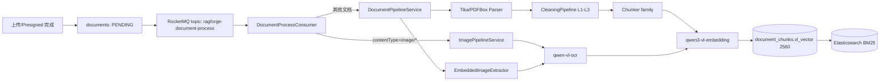
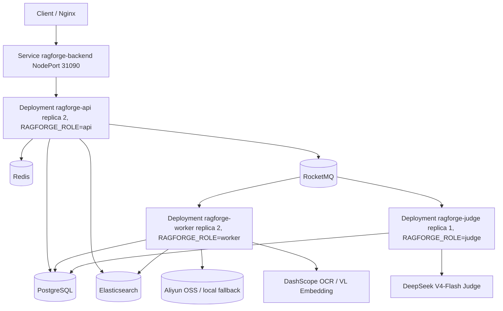

# RAGForge V5 架构文档

> 当前真实版本：2026-06-22
> 口径：本文只描述当前代码和 K3s 部署事实，不沿用早期 V5 设计稿里已经废弃的外置 OCR、图片描述、多 topic 或按模态拆 Worker 方案。

## 1. 系统定位

RAGForge V5 是面向多租户知识库的 RAG 基础设施。T11 后它同时提供两类能力：

- 检索：`/api/v1/search` 返回 chunks、scores、citations snapshot 和分段 latency。
- 应答：`/api/v1/answer` 基于检索结果生成带引用答案，并写入 `answer_logs`。

RAGForge 不保存对话历史，不提供 ChatMemory。Answer-as-LLM 是一次性 RAG answer，不是聊天产品。

## 2. 技术栈

| 层级 | 当前实现 | 代码/配置依据 |
|---|---|---|
| 后端 | Spring Boot 3.5.x + Java 21 | `backend/pom.xml` |
| 认证 | Spring Security + JWT/JWKS + Auth Gateway 代理 + API Key | `security/*`, `auth/*` |
| 数据库/向量库 | PostgreSQL + pgvector | `document_chunks.vl_vector` |
| 关键词检索 | Elasticsearch 8.x | `EsSearchService` |
| MQ | RocketMQ，单一 topic `ragforge-document-process` | `DocumentProcessProducer.TOPIC` |
| 文档解析 | Apache Tika / PDFBox | `DocumentParser` |
| OCR | DashScope `qwen-vl-ocr` | `EmbeddingProperties.Ocr` |
| Embedding | DashScope `qwen3-vl-embedding` | `DashScopeVlEmbeddingClient` |
| Answer LLM | 默认 `qwen-plus`，KB 可显式配置 `qwen-max` | `AnswerService.selectModel`, V29 |
| 监控 | Spring Actuator + Micrometer Prometheus | `/actuator/prometheus` |
| 部署 | K3s 单节点，namespace=`ragforge` | `deploy/k8s/ragforge/*` |

## 3. V5 多模态统一空间

T10-rewrite 后，多模态不再使用文本/图片双向量空间融合，也不再生成独立图片描述 chunk。文本 chunk、图片 OCR chunk、PDF/Office/HTML 内嵌图片 chunk 都进入同一个 `vl_vector` 2560 维空间。



关键事实：

- `DocumentProcessProducer.TOPIC` 是单一 topic，当前值为 `ragforge-document-process`。
- `DocumentProcessConsumer` 内部按 `contentType` 判断是否走 `ImagePipelineService`。
- `DashScopeVlEmbeddingClient.VL_DIMENSION = 2560`，所有召回统一走 `vl_vector`。
- `SearchRequest.modality` 和 `queryImageBase64` 已是兼容字段，`RetrievalService` 会记录 deprecated metric 但召回阶段不再按 modality 分支。

## 4. 导入与处理链路

```text
POST /api/v1/documents 或 presigned B 通道确认
-> IngestService.register
-> documents 写入/替换，parse_status=PENDING
-> afterCommit 发送 ragforge-document-process
-> DocumentProcessConsumer CAS claim
-> 文本或图片 pipeline
-> cleaning / chunking / OCR / embedding
-> document_chunks 写 PG + ES index
-> documents COMPLETED / FAILED
```

幂等和并发控制点：

- `IngestServiceImpl` 按 `externalId -> sourceUrl -> contentMd5` 解析身份。
- REPLACE 路径保持 `docId` 不变，事务内删 chunks 和更新 doc，ES/OSS/MQ 放在 afterCommit。
- `DocumentProcessConsumer` 调 `DocumentMapper.markProcessingIfRunnable` 做 CAS，防止多 worker 重复处理同一文档。

## 5. 检索链路

| strategy | 真实语义 |
|---|---|
| `keyword` | Elasticsearch BM25 |
| `vector` | query 经 `qwen3-vl-embedding` 编码后查 `vl_vector` |
| `hybrid` | vector + keyword + RRF |
| `rewrite` | query rewrite 后多路 vector |
| `full` | rewrite + hybrid + rerank |

`RetrievalService` 是统一入口，搜索、评测、Answer 都复用它。它已内置策略级限流、超时和 Prometheus latency 指标。

## 6. Answer-as-LLM

T11 新增 `AnswerService`、`PromptBuilder`、`CitationLinker`、`GuardRails` 和 `/api/v1/answer` SSE 接口。

流程：

```text
KB answer_mode 校验
-> RetrievalService.retrieve
-> PromptBuilder 组装 [n] chunks，IMAGE chunk 标记“来自图片 OCR + 上下文”
-> LlmService.streamGenerate
-> CitationLinker 解析 [n] 并给 IMAGE 引用生成 presigned imageUrl
-> GuardRails 拦截 NO_CITATIONS / PII_LEAK / OUT_OF_SCOPE
-> answer_logs 持久化
-> SSE complete
```

默认模型是 `qwen-plus`。`knowledge_bases.answer_model` 允许用户显式配置更贵的 `qwen-max`。

## 7. 安全与多租户

安全模型详见 [security-and-multitenancy.md](./security-and-multitenancy.md)。架构上要点如下：

- JWT user、SERVICE_ACCOUNT、admin 三类 principal 统一落到 `RagAuthContext`。
- 后台接口走 JWT，搜索/Answer/MCP 可走 JWT 或 API Key。
- `KbAccessGuard` 做 KB 级读写管理权限判断；文档级权限通过 doc -> kb 解析。
- `retrieval_logs`、`answer_logs` 记录 tenant/principal/trace/citations snapshot。

## 8. K3s 部署拓扑

真实部署目标是单节点 K3s：

```text
node: 8.138.191.228
namespace: ragforge
```

T12 后 backend 拆为三类 Deployment：



角色语义：

| role | 行为 |
|---|---|
| `api` | 接 HTTP，不注册 RocketMQ Consumer |
| `worker` | 消费文档处理 MQ，`spring.main.web-application-type=none`，不暴露 HTTP |
| `judge` | 消费 `ragforge-answer-judge` topic，`consumeThreadNumber/Max=20`（注解硬编码，改并发需改代码重打镜像） |
| `all` | 默认值，单机开发/兼容部署时 HTTP + 全部 MQ Consumer 都启用 |

不拆多个文档处理 topic，也不按文本/图片拆 Worker，因为 T10-rewrite 后 text 和 image 都调用 DashScope API，资源画像趋同。

## 9. 可观测性

Prometheus 暴露路径：

```text
/actuator/prometheus
```

核心业务指标见 `docs/grafana-v5.json`：

| 指标 | 类型 | 标签 | 含义 |
|---|---|---|---|
| `ragforge.ingest.created` | counter | - | 新文档注册数 |
| `ragforge.ingest.skipped` | counter | - | 身份命中且跳过数 |
| `ragforge.ingest.replaced` | counter | - | 硬覆盖注册数 |
| `ragforge.worker.processing_duration` | timer | `modality` | worker 文档处理耗时 |
| `ragforge.worker.failed` | counter | `reason` | worker 处理失败 |
| `ragforge.embedding.vl.calls` | counter | - | VL embedding 调用次数 |
| `ragforge.embedding.vl.tokens` | counter | `type` | VL 输入估算 token |
| `ragforge.ocr.qwen_vl_ocr.calls` | counter | - | OCR 调用次数 |
| `ragforge.ocr.qwen_vl_ocr.tokens` | counter | `type` | OCR image/output token |
| `ragforge.answer.tokens` | counter | `type` | Answer prompt/completion token |
| `ragforge.answer.citations_total` | counter | `kb`（可选） | 累计引用数 |
| `ragforge.answer.retrieval_results_total` | counter | `kb`（可选） | 累计检索结果数 |
| `ragforge.answer.guard_rail.blocked` | counter | `reason` | Answer GuardRails 拦截 |
| `ragforge.kb_access_denied` | counter | `operation` | KB 访问被过滤/拒绝 |
| `ragforge.search.latency` | timer | `strategy` | 检索总耗时 |

建议告警阈值：

| 告警 | PromQL 口径 | 阈值 |
|---|---|---|
| DashScope 单日成本 | `docs/grafana-v5.json` 中 Daily DashScope Cost Estimate | `> ¥50` warning，`> ¥200` critical |
| LLM 单日 token | `sum(increase(ragforge_answer_tokens_total[1d]))` | `> 1000000` warning |
| Worker failed rate | `sum(rate(ragforge_worker_failed_total[5m])) / sum(rate(ragforge_worker_processing_duration_seconds_count[5m]))` | `> 5%` warning |
| KB access denied 突增 | `sum(rate(ragforge_kb_access_denied_total[5m]))` | 基线突增 warning |

## 10. 当前口径约束

V5 当前架构只保留统一 `vl_vector`、单一 MQ topic、两类运行角色和 K3s 生产部署口径。旧版外置 OCR、图片描述、多向量空间融合、按模态拆 Worker、旧生产编排等方案不再作为当前架构描述。
